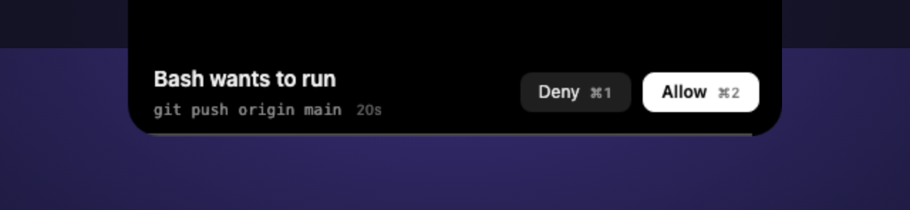
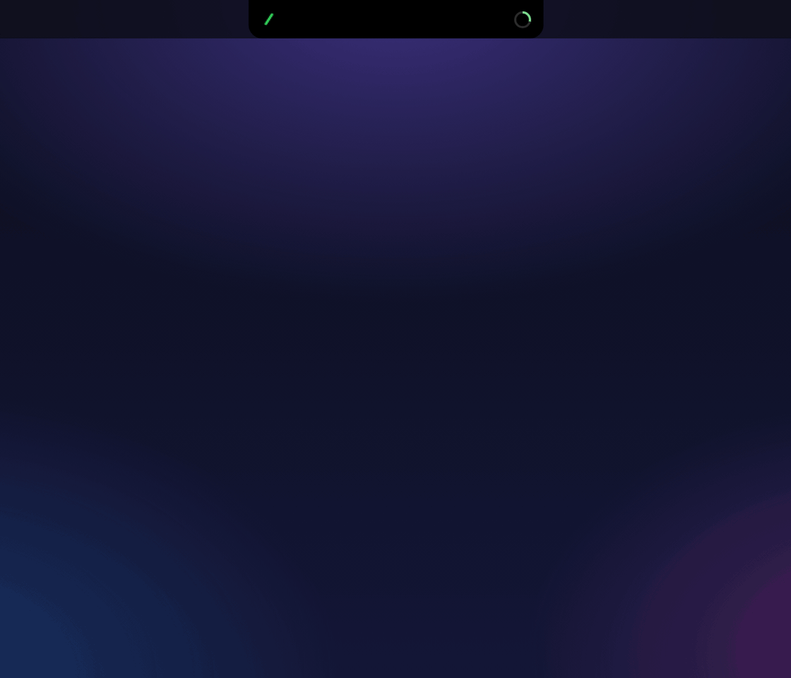

<h1 align="center">Peekle</h1>

<p align="center"><b>Claude Code, answered from the MacBook notch.</b><br />
The agent asks, the notch grows, you press ⌘1 or ⌘2 from whatever app you are in.</p>

<p align="center"></p>

<p align="center">
  <a href="https://github.com/MarselNet86/peekle/releases/latest"></a>
  <a href="https://github.com/MarselNet86/peekle/releases"></a>
  <a href="https://github.com/MarselNet86/peekle/actions/workflows/release.yml"></a>
  <a href="LICENSE"></a>
  <a href="https://github.com/MarselNet86/peekle/stargazers"></a>
</p>

<p align="center">
  <a href="#install">Install</a> ·
  <a href="#what-it-does">What it does</a> ·
  <a href="#keys">Keys</a> ·
  <a href="#why">Why</a> ·
  <a href="docs/features/README.md">Feature log</a> ·
  <a href="https://t.me/daimonLabs">Telegram</a>
</p>

---

## Install

One command. macOS 13 or newer, Apple silicon and Intel in one build:

```sh
curl -fsSL https://raw.githubusercontent.com/MarselNet86/peekle/main/install.sh | sh
```

It downloads the latest release, checks it against the checksum in that
release's own cask, puts Peekle in Applications, clears the Gatekeeper flag,
links the `peekle` command, writes the Claude Code hooks and opens the app.
Read [install.sh](install.sh) first if you like.

**With Homebrew.** The same app and command, kept up to date by `brew`:

```sh
brew install --cask MarselNet86/tap/peekle
peekle init
open -a Peekle
```

**By hand.** Download
[Peekle-mac-universal.dmg](https://github.com/MarselNet86/peekle/releases/latest/download/Peekle-mac-universal.dmg)
and drag it to Applications. The bundle is signed ad hoc rather than
notarized, so macOS refuses it once; clear the flag and it opens:

```sh
xattr -dr com.apple.quarantine /Applications/Peekle.app
/Applications/Peekle.app/Contents/MacOS/peekle init
open -a Peekle
```

(Or open it, let macOS refuse, then System Settings → Privacy & Security →
Open Anyway. With Rust on the machine,
`cargo install --git https://github.com/MarselNet86/peekle peekle-cli` puts
the command on your PATH instead.)

Want it on Windows or Linux? Vote in
[#11](https://github.com/MarselNet86/peekle/issues/11).

**What `init` does.** Peekle listens to Claude Code through its hooks, and
`init` writes them: it merges its entries into `~/.claude/settings.json`,
takes a timestamped backup first, never touches anyone else's hooks, and
changes nothing on a second run. `peekle doctor` says what is wrong if
something is; `peekle uninstall` takes back only its own entries.

No account, no login, no telemetry. Usage bars read your own Claude account
from the Keychain, and only after you press Grant.

---

## What it does

<p align="center"></p>

**The island.** At rest it is the notch, two strokes of green in the bezel that
say Peekle is running and a ring that says how much of your five-hour window
is gone. When a turn ends the notch grows into a pill with who finished and
what they said. Click it and the pill grows into the chat.

**Permissions, from anywhere.** `Bash wants to run git push origin main` opens
as two lines and two buttons. ⌘1 denies, ⌘2 allows, from whatever app you are
in. The answer goes back into the hook response, so the turn continues without
you touching the terminal. Twenty seconds later the island folds, the request
stays pending, and the mark pulses until you come back to it.

**Questions, with digits.** When the agent asks which of three things you
want, the options come up as cards with ⌘1, ⌘2, ⌘3, and an Other that lets you
write your own. Every answer lands in the tool's own response format; nothing
is typed into a terminal on your behalf.

**Chats, started here.** New session picks a folder, a model, an effort and a
permission mode, then runs `claude` in a pty of its own. Type a message, attach
a file with the plus, or press ⌃⇧⌘4: the screenshot goes on the clipboard, the
notch offers to attach it for five seconds, ⌘1 takes it. Compact from the ring
in the corner. Sessions you started in your own terminal show up too, read
only, with their whole transcript.

**Usage, from your account.** The five-hour and seven-day windows, read the way
Claude Code reads them, on the mark, in the header and as a badge that steps
out when a ten is crossed.

**Updates.** Every six hours Peekle checks its own releases. A newer dmg is
pulled quietly; only once it is on disk does the island ask, and only over a
resting island, never on top of a chat you are reading. Later means a day.

Every feature above has a shot in the [feature log](docs/features/README.md).

### Keys

| Keys    | What                                                    |
| ------- | ------------------------------------------------------- |
| ⌘1 … ⌘9 | Answer the request or question on screen, from anywhere |
| ⌥⇧Q     | Quiet: Peekle stops asking, every hook passes through   |
| ⌥⌘Q     | Ask to quit                                             |
| ⌃⇧⌘4    | Screenshot to the clipboard, then ⌘1 to attach it       |
| Esc     | Put the island away                                     |

---

## Why

The agent runs for a minute, asks one question, and waits. You are in the
browser, or in another repo, or reading. Every tool that exists for this moment
either notifies you and sends you back to the terminal, or lives in the notch
but needs tmux to talk back. Peekle answers from where you are, and the answer
is the hook's own response, not keystrokes typed into someone's screen.

| &nbsp;                        | Peekle              | [ClaudeIsland](https://github.com/farouqaldori/vibe-notch) | [claudecodenotify](https://github.com/narlei/claudecodenotify) | the terminal  |
| ----------------------------- | ------------------- | ---------------------------------------------------------- | -------------------------------------------------------------- | ------------- |
| RAM at idle                   | ~180 MB, 4 procs    | ~115 MB, 1 proc                                            | ~30 MB, 1 proc                                                 | 0             |
| Answer goes back to the agent | ✅ hook response    | ✅ typed into tmux                                         | ❌ jumps you to the terminal                                   | you are there |
| Permission from any app       | ✅ ⌘1 / ⌘2          | ✅ from the notch                                          | ❌                                                             | ❌            |
| Questions with options        | ✅ ⌘1 … ⌘9          | –                                                          | ❌                                                             | ✅            |
| Start a chat from the overlay | ✅                  | ❌                                                         | ❌                                                             | ✅            |
| Reply to the agent in words   | ✅ sessions it runs | tmux only                                                  | ❌                                                             | ✅            |
| Screenshot into the chat      | ✅ ⌃⇧⌘4             | –                                                          | ❌                                                             | ❌            |
| Usage bars from your account  | ✅                  | –                                                          | ✅                                                             | ❌            |
| Lives in                      | the notch           | the notch + menu bar                                       | menu bar                                                       | –             |
| Telemetry                     | none                | Mixpanel, anonymous                                        | none                                                           | none          |
| Account required              | ❌                  | ❌                                                         | ❌                                                             | ❌            |
| Open source                   | ✅ MIT              | ✅                                                         | ✅ MIT                                                         | –             |

Memory measured on an M4 MacBook, macOS 26, each app launched alone and left
idle for 45 seconds, summing the app and the processes it spawned. Peekle is a
WebView app and pays for it in memory; the other two are native Swift. A dash
means not found in their README. The terminal stays in the table because it is
what most of us actually use: it costs nothing and it is never where you are.

---

## How it works

```
Claude Code turn
  |  POST /v1/h/<token>/<endpoint>        the hook script, loopback only
  v
peekle-server (axum, 127.0.0.1)          registers the request, tells the island
  v
the island                               you answer, or walk away
  v
HTTP response body                       the decision Claude Code executes
```

If Peekle is not running the connection fails, Claude Code treats that as a
non-blocking error and works normally. An agent never hangs on a dead overlay.
A request the island could not ask returns to the terminal, where Claude Code
shows its own prompt.

Rust holds every window, hook and decision; the island itself is Svelte in a
WKWebView, drawn from a fixed set of primitives. Tauri 2 underneath.

---

## Dev notes

I write about what I am building on Telegram: release notes, screenshots of
things half done, benchmarks, and what broke on the way. Usually before it
shows up here.

👉 **[t.me/daimonLabs](https://t.me/daimonLabs)**

---

## Contributing

Pull requests welcome. [CONTRIBUTING.md](.github/CONTRIBUTING.md) has the setup, the
conventions and the gate. Open an issue first if you plan something big, so we
do not both build it.

```
src/lib/ui           primitives, nothing else draws
src/lib/logic        pure TypeScript, property tested
src-tauri            windows, panels, commands, state
crates/peekle-core   types, config, pending registry
crates/peekle-server axum router for the hook endpoints
crates/peekle-cli    peekle init, doctor, status, uninstall
```

## License

MIT. See [LICENSE](LICENSE).

<p align="center"><b>⭐ Star the repo if Peekle saved you a trip to the terminal</b></p>

<p align="center">
  <a href="https://github.com/MarselNet86/peekle/issues/new?labels=bug">Report a bug</a> ·
  <a href="https://github.com/MarselNet86/peekle/issues/new?labels=enhancement">Request a feature</a> ·
  <a href="https://t.me/daimonLabs">Dev notes</a>
</p>
