# Features

One entry per shipped feature, newest first: what it does, why, and where to
look at it. The contract for each lives in `tech.md` under the section named in
its row; this log exists so the repository itself remembers what was built and
carries the shots and clips that show it.

Add an entry when a feature merges. Keep it to what a person needs to recognise
the thing on screen — the reasoning belongs in `tech.md`, the mechanics belong
in the code.

Screenshots and clips live in [`shots/`](shots).

| Version | Feature                                                                                     | Contract             |
| ------- | ------------------------------------------------------------------------------------------- | -------------------- |
| v80.1   | [The app icon is the sign](#v801--the-app-icon-is-the-sign)                                 | 9                    |
| v80     | [Stop asks, and says so](#v80--stop-asks-and-says-so)                                       | 6.3, 6.5, 6.11, 6.21 |
| v79     | [A slash command answers its own question](#v79--a-slash-command-answers-its-own-question)  | 6.5, 6.15            |
| v78     | [A compact you can see](#v78--a-compact-you-can-see)                                        | 6.1, 6.3, 6.5, 6.21  |
| v77     | [The turn notice, as the system writes one](#v77--the-turn-notice-as-the-system-writes-one) | 6.2, 6.3, 6.7, 9     |
| v76     | [A question waits for you](#v76--a-question-waits-for-you)                                  | 6.7, 6.14, 9         |
| v75     | [A question gets the room and a way out](#v75--a-question-gets-the-room-and-a-way-out)      | 6.3, 6.7, 6.14, 9    |
| v74     | [The head moves up beside the notch](#v74--the-head-moves-up-beside-the-notch)              | 6.7, 6.12, 9         |
| v68     | [The answer stands where you look](#v68--the-answer-stands-where-you-look)                  | 6.15, 6.20, 9        |
| v67.1   | [A peer message is its words](#v671--a-peer-message-is-its-words)                           | 6.5, 6.11            |
| v67     | [One transcript, one process](#v67--one-transcript-one-process)                             | 6.5, 6.11            |
| v66     | [The field never refuses](#v66--the-field-never-refuses)                                    | 6.5, 9               |
| v65     | [Composer row, as the original](#v65--composer-row-as-the-original)                         | 6.12, 6.15, 6.20, 9  |
| v64     | [Live mode switching](#v64--live-mode-switching)                                            | 6.19, 9              |
| v63     | [Permission mode](#v63--permission-mode)                                                    | 6.3, 6.5, 6.19, 9    |
| v62     | [Usage request, as the CLI sends it](#v62--usage-request-as-the-cli-sends-it)               | 6.4                  |
| v61     | [Sign in says what it decided](#v61--sign-in-says-what-it-decided)                          | 6.3, 6.12, 6.16, 9   |
| v60     | [Composer layout](#v60--composer-layout)                                                    | 6.12, 6.15, 9        |
| v59     | [Permission panel](#v59--permission-panel)                                                  | 6.3, 6.7, 9          |
| v58     | [Usage badge](#v58--usage-badge)                                                            | 6.8, 6.10, 6.18, 9   |
| v57     | [Work line](#v57--work-line)                                                                | 6.12, 9              |
| v56     | [Stop in the field button](#v56--stop-in-the-field-button)                                  | 6.5, 6.15, 9         |

## v80.1 — The app icon is the sign

2026-09-10

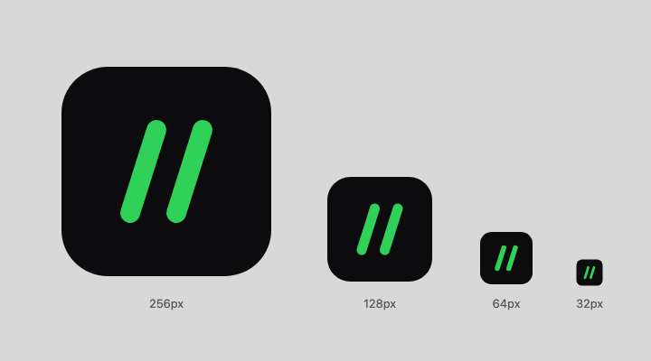

The icon in Finder was a green dot, which the product uses nowhere. It is the
two strokes now, the same `//` the resting island carries: same slant, same
ratio of stroke to length, `--brand` green on the island's own black.

The mark is drawn once in `src-tauri/icons/icon.svg` and rasterised by
`node scripts/make-icon.mjs`, which writes every size Tauri lists and hands the
full iconset to `iconutil`. Edit the SVG, run the script; nothing in the icon
folder is hand-painted.

## v80 — Stop asks, and says so

2026-09-10

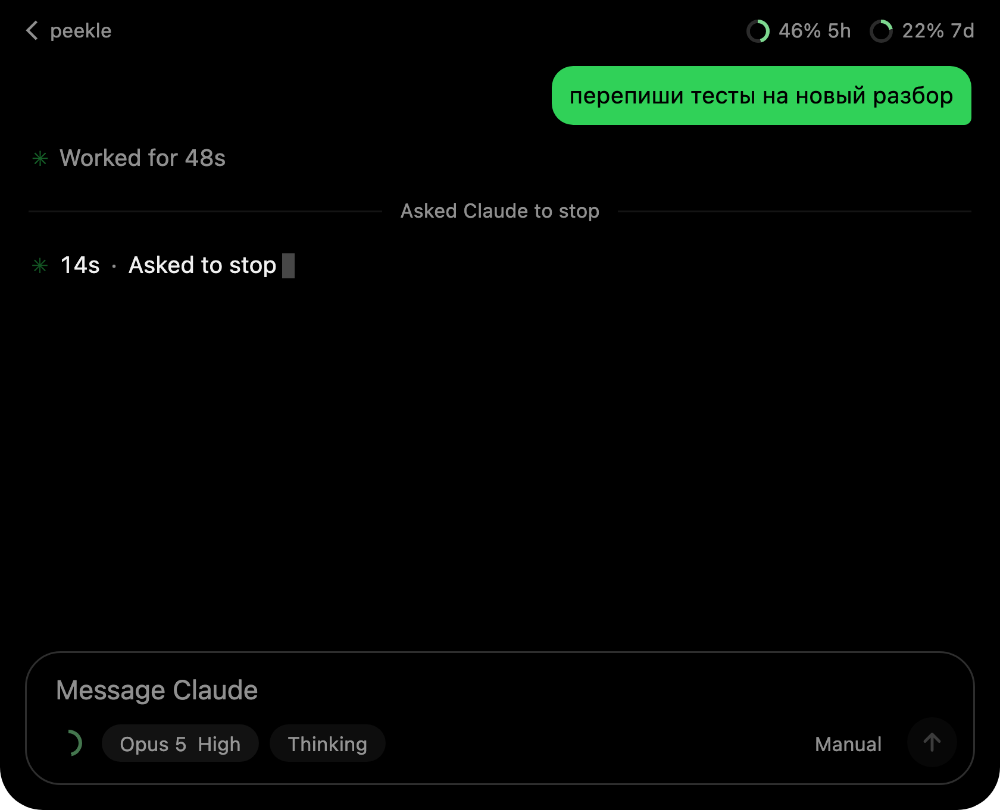

Pressing Stop on a chat Peekle does not own put a green bubble in the feed:

> Stop. End this turn now without running anything else, and say in one line
> where you left off.

Nobody typed that. It is the request Peekle writes into the live process's
inbox, because the inbox has no interrupt frame — and it came back through the
same `UserPromptSubmit` as anything a person types. tech.md 6.11 already
forbids exactly this for a `user` record nobody typed, and names the three
consequences it exists to prevent: a bubble in the person's own colour, a
title taken from it, and a reply still in flight marked delivered by it. All
three happened. 6.5 said the opposite for this one message; the contradiction
is settled in 6.11's favour.

The request is now recognised by its own words after the wrapper is stripped —
the live hook carries no marker at all, so the words are the only thing that
works on both paths. No turn is made from it, and the file puts one line where
it stands, the way `Compacted` and `Switched to …` already do: **Asked Claude
to stop**.

The second half of the report was "and then the model seems to start working
on its own". It was: the request is a turn, so the agent woke up and answered
it, and the clock was dated from a bubble nobody sent. Now the card carries
`stopping` while the request stands — the work line says one true word,
**Asked to stop**, with the clock running from the press; the button takes one
press and answers a second with a note instead of queueing a second turn in
somebody's chat; and the flag is cleared by the end of the turn or by a
sixty-second ceiling.

Two compact bugs, found by an adversarial review of v78 and fixed here: the
end of a compact is now read before the checks about the feed (a refused
compact on a chat with nothing said in it kept the sign orange for the full
ten minutes), and a card that ends carries neither a compact nor a request —
one finished card was enough to hold the whole island orange.

## v79 — A slash command answers its own question

2026-09-10

Nothing new to look at, which is the point: the message you type after
changing a setting now reaches the agent.

Picking `Ultracode` wrote `/effort ultracode` into the session and looked
like it worked. It did — but on a conversation that is already cached the CLI
does not apply it silently. It draws a dialog:

```
Change effort level?
This conversation is cached for the current effort level. Switching to xhigh
means the full history gets re-read on your next message.
  ❯ 1. Yes, switch to xhigh
    2. No, go back
```

and the TUI stays modal on it. Everything written next belongs to that dialog.
So the message typed after the pick was swallowed whole and its own newline
answered the question — the agent never saw a word of it, while the island had
already drawn the bubble as sent. Reproduced on a live 2.1.263 with Opus 5,
twice: once through a pty driven by hand, once through `PtyHost` itself.

A slash command now goes as three writes rather than two: the line, its
newline, and 400ms later one more. The second newline takes the option under
the cursor — the change that was just asked for — and on a command that raised
no dialog it lands in an empty input box, where a newline does nothing at all.
That is the same ground the delivery nudge has always stood on.

A reply still goes as two: a message is never asked a question back, and a
spare newline behind one is an empty turn.

## v78 — A compact you can see

2026-09-10

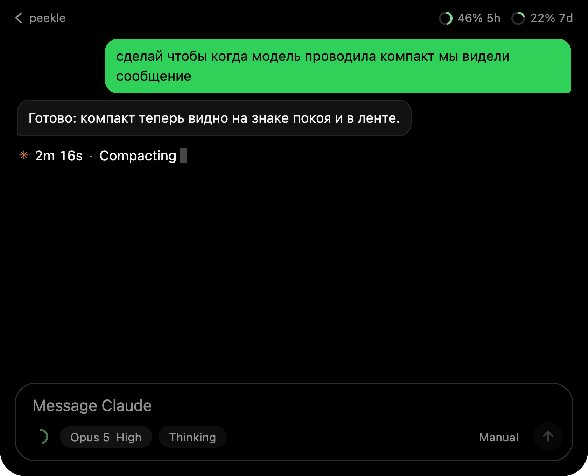

`/compact` used to leave no trace in the island at all. The chat stood still,
the notch stood green and empty, and the thing the CLI was doing took between
seven seconds and three minutes — measured, not guessed, off twenty-four
`compactMetadata` records. Nothing said it had started and nothing said it was
over, which is the one state this product exists to remove.

The start comes from `PreCompact`, the hook Peekle did not listen for.
**Re-run `peekle init` after updating**: the handler is written into
`~/.claude/settings.json`, and a compact cannot announce itself through a hook
that is not installed.

The end comes from the file, because no hook fires at all when a compact
finishes — checked on a session driven live, where the compact was followed by
neither a `Stop` nor a `SessionStart`. What is written is a `compact_boundary`
record, and it carries the numbers as well as the news.

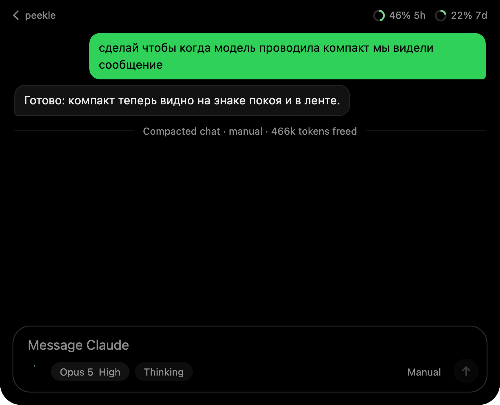

So the row says what the terminal says, down to the number: the terminal
prints `preTokens`, not the difference and not what is left. A manual compact
opens the dialogue on that row when it lands — the person typed the command
and waited out the minutes, and the answer to them is that one line. An
automatic one opens nothing: nobody asked for it.


The resting sign carries it in `--orange` with the wave the waiting state
uses. Two states now have a colour of their own, and both are states where
something is happening to somebody: purple is the agent waiting on you, orange
is the chat being folded up.

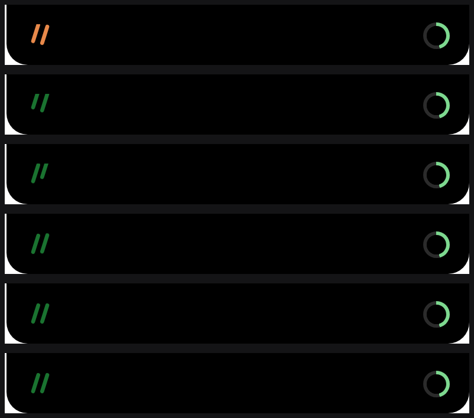

Every change of state hops both strokes, the second behind the first, so a
compact ending while nobody is watching the notch is seen ending rather than
found already ended.

One more thing the same hook fixed. `/compact` typed into the island's own
field is a message like any other, and it is the one message nothing ever
confirms: no `UserPromptSubmit` fires for a slash command. The bubble sat grey
and then went red — the island calling it undelivered while the CLI was
compacting on it. `PreCompact` is the delivery note now.

Two edges, both real. `PreCompact` fires **before** the CLI decides whether
there is anything to compact — a chat of two replies gave the hook and then
`Not enough messages to compact.` eight milliseconds later — so the local
command line the CLI prints instead takes the sign back off. And a compact
that ends in neither is given up on after ten minutes, because a sign nothing
can take off is worse than no sign.

## v77 — The turn notice, as the system writes one

2026-09-10

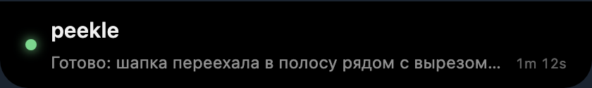

The pill was one 13px line — `peekle · Готово: шапка переехала…` — with the
project and the words run into a single sentence and clipped wherever the room
ran out, which was always in the words.

It is folded the way the permission panel is now: who finished on top, what
they said under it in the quiet colour, and how long the turn took at the end
of that line. The clock runs from the last thing the person said in that chat,
the way the work line counts: they started waiting when they sent. Nothing of
theirs to count from means no number at all rather than an invented one. The
shape grows to the panel's height for the second line, and only for it — a
switch flipping is still one line.

## v76 — A question waits for you

2026-09-10

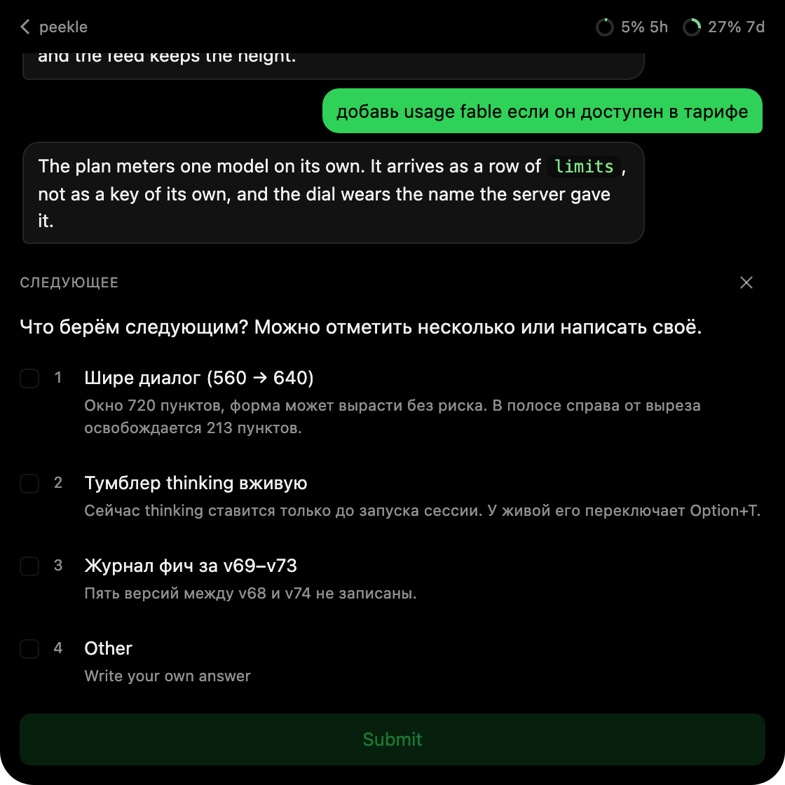

A question is not one more thing the island shows: it is the agent parked and
waiting for one person. So the island stops putting it away — the pointer
leaving no longer collapses it and the 45 second hold does not apply — while a
click beside the shape still does, because that is a decision rather than a
hand wandering off.

The cross refuses it. An empty answer used to mean "ask them yourself", so
Claude Code put the same question in the terminal: there was no way out of a
question, only a way to move it. Now the tool is denied with a line saying
what happened, and the agent goes on.

Nothing else moves while it stands: the feed is folded as a session that is
not working, so the clock and the spinner go and the run that led up to the
question closes as the line it is. And once it is put away by hand, the
resting sign says who is waiting — it turns violet and a wave runs through the
two strokes, one rising while the other falls.

## v75 — A question gets the room and a way out

2026-09-10

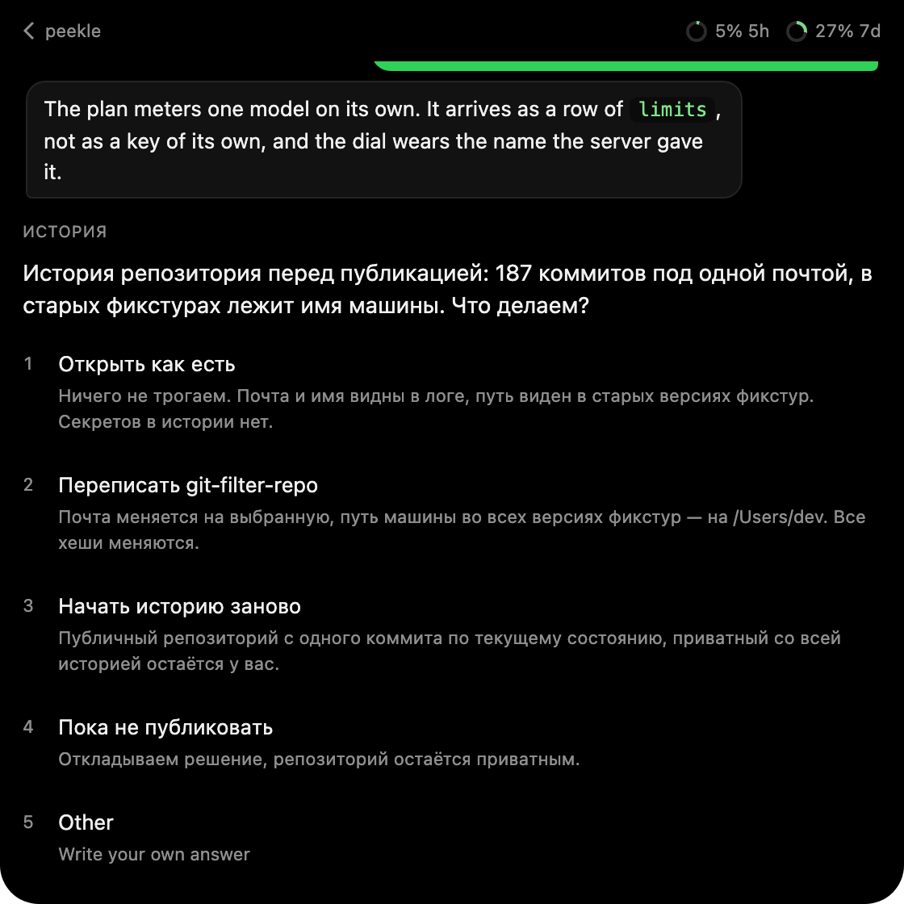

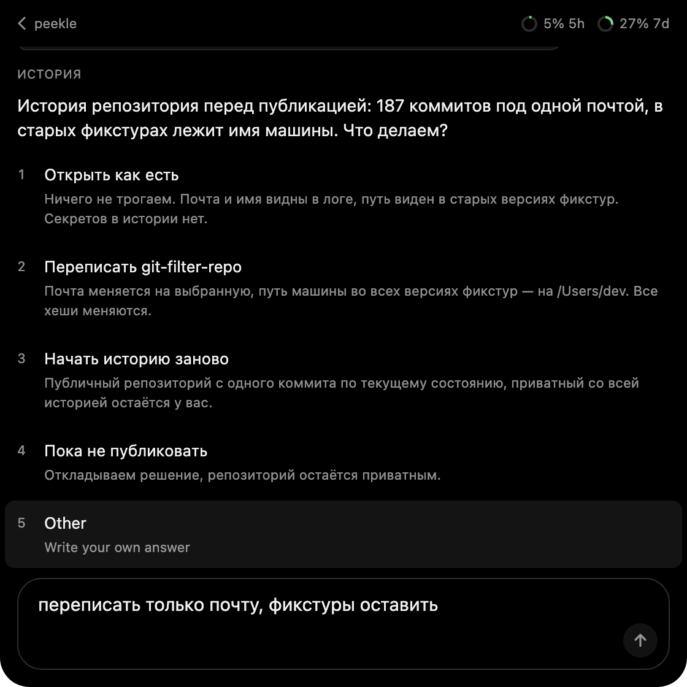

Three things about `AskUserQuestion`, one of them a bug worth naming.

The panel outlived the question. Claude Code puts its own question on screen
without waiting for the hook, so an answer given there runs the tool while the
island is still holding the panel up — and it held it for five minutes, until
the hook timed out, over a question that was already answered. A `PostToolUse`
for the same session and the same tool now takes it down. Both marks are
needed: chats run side by side and a turn runs tools in parallel, so neither
alone says anything about the question on screen. The session stays working,
because the tool ran.

Four options with their descriptions are taller than the dialogue, and the
last of them was cut off by the bottom edge. The shape takes the whole window
while a question stands and gives it back once it is answered; anything longer
still scrolls inside the panel rather than being cut.

And there was no way to answer anything but what Claude had listed. The last
row is Other now, and it opens a field. What gets written goes out as the
label of the answer, which is what the reply carries anyway.

## v74 — The head moves up beside the notch

2026-09-10

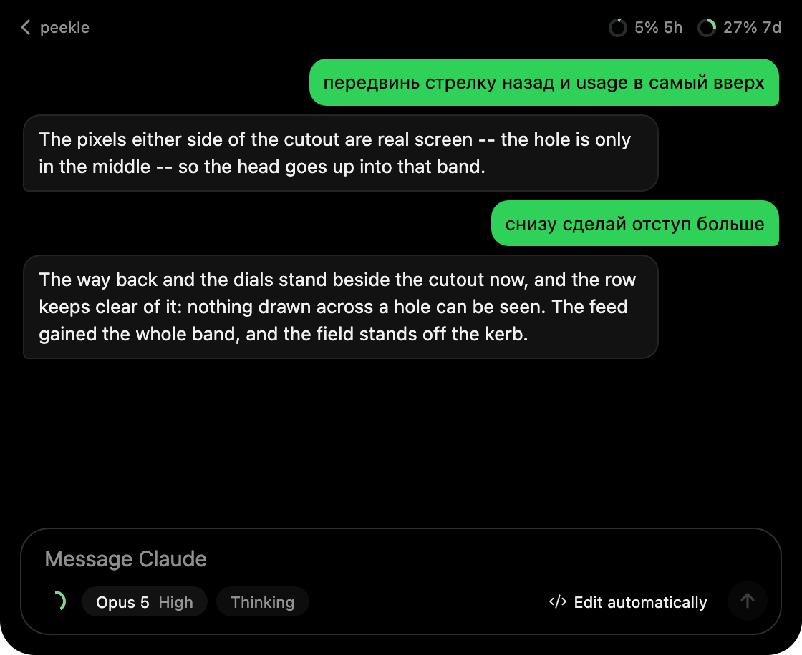

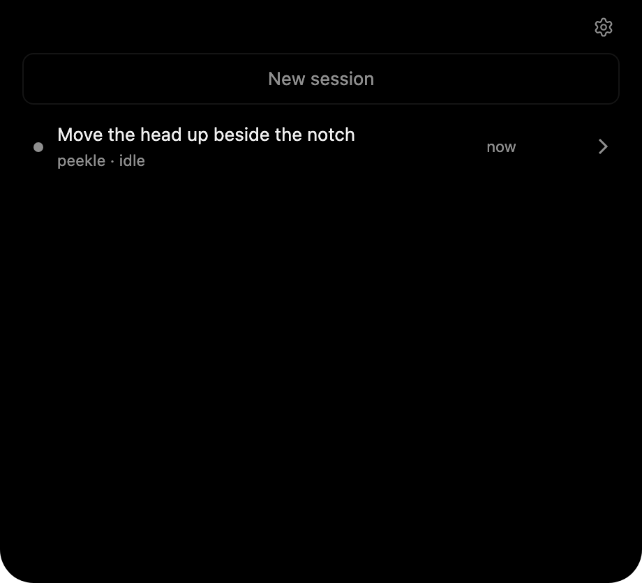

The island drew nothing in the band beside the camera cutout. The cutout is a
hole in the middle of the top edge, but the pixels either side of it are real
screen, and the content was pushed below all of it — a black strip the full
width of the shape, while the conversation underneath was short of room.

The top row of each view now stands in that band: the way back with the
project name on the left, the usage dials on the right, the gear of the
session list where the gear already was. The gap between the two ends is the
cutout itself, and each end is cut off at its own half of the band, so a long
project name ends in an ellipsis rather than disappearing into the hole —
nothing drawn across it can be seen at all. On a display with no notch both
numbers are zero and the row stands where it always did.

The feed keeps the whole band, and its bottom padding grew from 8 to 14 where
the field stood on the kerb. Measured on a 14 inch: the cutout is 185 by 34
points, which leaves 173 beside it and the two dials take 128.

## v68 — The answer stands where you look

2026-09-09


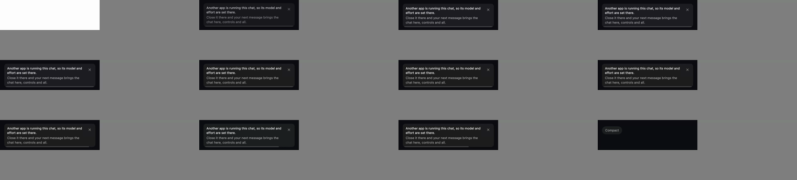

Pressing a control that only reads used to answer under the feed, by the
input, and the answer went away on its own. So the press looked like nothing
happened: the explanation appeared where the eye was not, and left before it
got there.

Now it is a panel above the feed. It comes down from the top edge on the curve
Apple uses for an arriving sheet, stands ten seconds, and a hairline under the
text runs its term down so the time is seen rather than guessed. The cross
closes it early. Hovering holds both the hairline and the clock, because
someone reading it is not spending it.

The compact ring was the worst case: on a chat another app runs it was
disabled outright, so pressing it gave neither a compact nor a reason. It
takes the press now and answers with the same panel. No control in that row is
silent any more.

## v67.1 — A peer message is its words

2026-09-09 · `92b35e8`

A reply delivered into a live session's inbox stood in the feed as five lines
of instruction addressed to the agent: who the message came from, and that a
peer cannot grant permission. Nobody typed that, and it is four times the
length of most replies.

The wrapper changed in 2.1.263 and lost its tag: the receiver now writes a
preamble line above the words and the standing instruction below them. Both
layers come off, the older tag included, so transcripts written before the
change still read. Only a whole first line counts as the preamble, so a reply
quoting the phrase keeps every word. The hook gets the bare words and never
needed unwrapping.

The doubled bubble goes with it: the island's own copy of the reply now
matches the one in the file instead of standing beside it.

## v67 — One transcript, one process

2026-09-09 · `9c723e7`

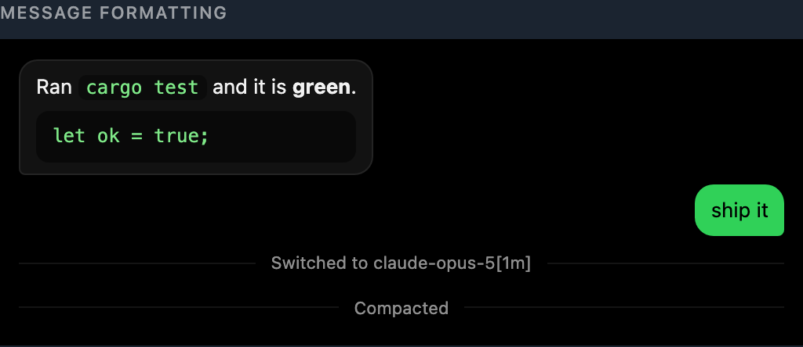

A message from the island into a chat VS Code held started a second `claude
--resume` on the same id, and two processes wrote into one file. The registry
record keeps `procStart` in UTC and `ps` prints the local clock, so the live
process read as dead. The start is now checked in both clocks; a chat somebody
holds goes into that process's inbox, never into a second process.

Three things the file taught while it was being read twice:

- `No response requested.` — the CLI's synthetic close of a turn the model
  never took. It was a red-rimmed failed answer. It is not a row.
- The compact summary the CLI writes to itself stood as a green bubble of two
  thousand characters. It is now the one-word notice `Compacted`, as in the
  terminal.
- After a compact the CLI writes the kept history into the same file again
  under the same ids. Each id is read once.

## v66 — The field never refuses

2026-09-09 · `e28bd62`

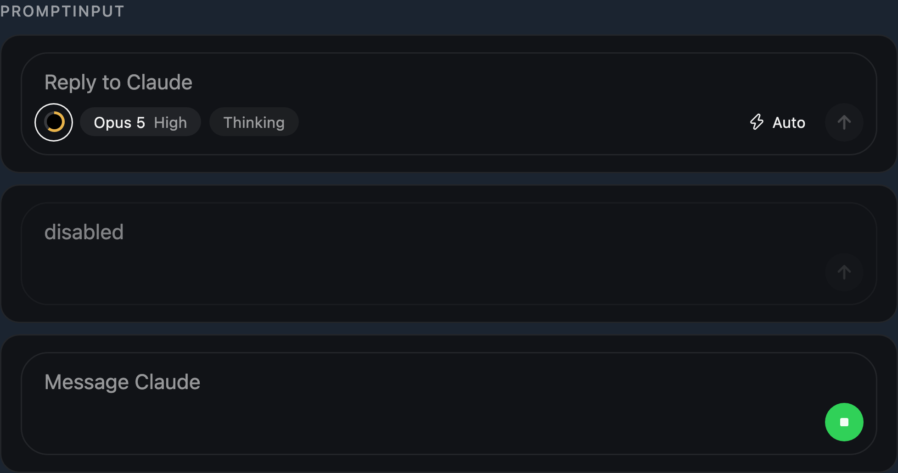

No "This session has finished", no "That chat is busy elsewhere", no dark
field. Every chat the island knows takes text; where the text goes is decided
at the moment of sending, along four routes, all four documented mechanisms of
the CLI:

| Chat                                                       | Route                                              |
| ---------------------------------------------------------- | -------------------------------------------------- |
| We hold its process                                        | its own pty                                        |
| Nobody holds it — ours that exited, theirs with no process | `--resume <id>`, same id, same transcript          |
| A live process holds it                                    | that process's inbox socket                        |
| Held, and takes nothing                                    | `--resume <old> --fork-session --session-id <new>` |

The three flags together were measured live on 2.1.263: the fork answers
questions about the old conversation, writes only to the new transcript, and
leaves the original untouched. Without `--session-id` the CLI picks the new id
and the chat is lost.

A copy is said out loud once, where the conversation now is — an id that
changes silently reads as the island having lost the chat.

## v65 — Composer row, as the original

2026-09-09 · `61f88e7`


Left to right: the context ring, the model with its weight, thinking, then a
gap, then the mode beside the send button. The ring is furthest from send
because it acts on what is already spent; the mode is nearest because it
decides what the next press may do.

One menu holds model and effort, the effort as a track carrying the CLI's own
five descriptions, with `ultracode` as the stop past the last level — its own
command, because `--effort` does not take it, and its own colour, `#d0b4ff`.

Thinking is a grey block with a switch. `MAX_THINKING_TOKENS=0` is the only
lever the CLI offers and the process reads it once at startup, so it is set
before a session runs and read after.

## v64 — Live mode switching

2026-09-09 · `1025df4`

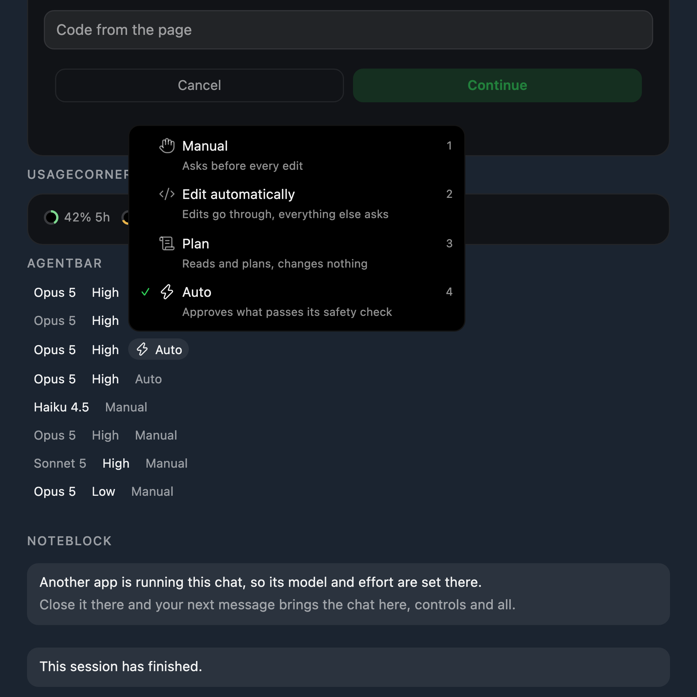

The cycle `Shift+Tab` walks was measured on a live TUI rather than assumed:
manual → accept edits → plan → auto → manual. Four states, and neither
`bypassPermissions` nor `dontAsk` is on it — no number of presses reaches
them, which is what makes stepping it on someone's behalf safe. So a running
session switches from the chip: one CSI Z per step, 250ms apart, confirmed by
the next hook.

Chevrons are gone. A sign carries what they carried — hand, `</>`, scroll,
bolt — and a value that only reads is dimmed instead. The menu takes a minimum
width, because one sized by its longest word wrapped every hint.

## v63 — Permission mode

2026-09-09 · `451c2e0`

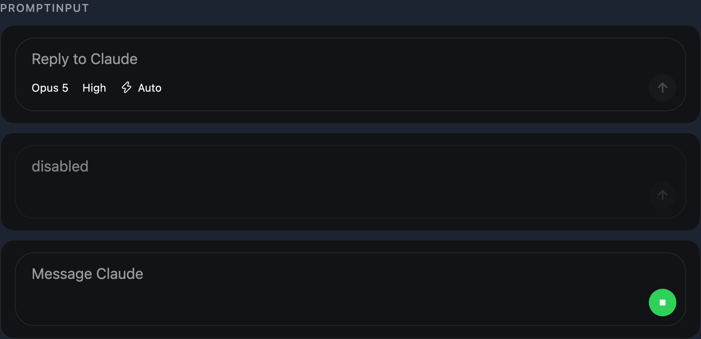

The mode sits in the composer closest to the send button, because it decides
what pressing send will be allowed to do: `Manual`, `Edit automatically`,
`Plan`, `Auto`, each with a line under it in the menu.

Read from `permission_mode`, which every hook of a live session carries. Set
with `--permission-mode` on a session Peekle starts — the CLI has no slash
command for the mode, and its inbox does not speak the control protocol that
does. A session already under way reads instead of picking: cycling Shift+Tab
blind through a list that contains `bypassPermissions` is not something to do
on someone's behalf.

## v62 — Usage request, as the CLI sends it

2026-09-09 · `23dcc7e`

Claude Code sends two headers on its claude.ai OAuth calls —
`Authorization: Bearer` and `anthropic-beta: oauth-2025-04-20` — and
`/api/oauth/usage` is one of them. Peekle sent the first only, so a good token
came back refused and the island called it `Signed out`.

Two more things copied from the same binary: the CLI checks `expiresAt`
against the clock rather than waiting for a 401 (120s soft, 30s hard), and on
a 401 it refreshes and retries once. Peekle cannot refresh — the entry belongs
to Claude Code — so it declines to spend a request on a spent credential, and
its retry is a second read of the entry.

## v61 — Sign in says what it decided

2026-09-09 · `933b7e8`

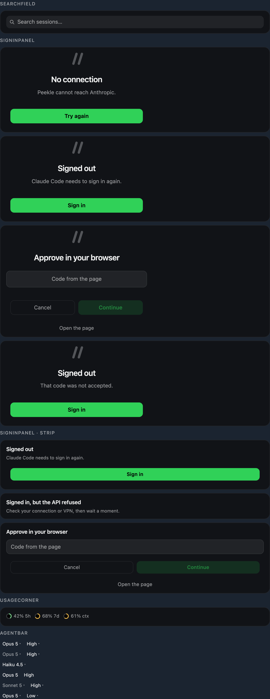

Pressing `Sign in` under the session list changed nothing on screen. The press
worked: the command asks the CLI first, `claude auth status --json` said the
account was signed in, and it published the verdict that a login would not
help. The strip had nowhere to put it — a title and a button, no line and no
error — so the press moved zero pixels.

The strip is the panel in one column now: title, line, error, the code field
when the CLI asks for one, and the way out. A new stage, `Refused`, separates
"signed in and the endpoint refused anyway" from "the login would not start":
the first offers no button, the second keeps one.

The action button spans its block in both forms, and the hairline above the
field is gone — the capsule draws its own edge.

## v60 — Composer layout

2026-09-09 · `de43a62`

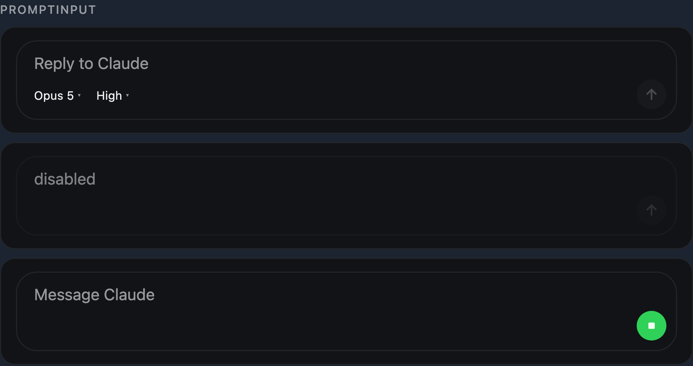

The field, its settings and the send button are one capsule: the text on top,
the model and the effort under it on the left, the send circle on the right —
the layout Claude Code's own composer uses, for the reason it uses it. Those two
are controls of the message being written, not a line about the session, and as
a separate strip above the field they read as a band between the feed and the
input.

The context ring left that strip for the top right corner, beside `5h` and `7d`.
Three rings answer one question — how much is left — so they stand together. It
is still the button that compacts, and still the only one.

Picker menus grow from the button that opened them rather than appearing whole.

## v59 — Permission panel

2026-09-09 · `ea284d8`


A permission opens the island a little instead of opening the whole dialogue:
the tool name, the input it was handed, `Deny` dark and `Allow` white. A
hairline under the text leaks through the twenty seconds the panel stands.
Pressing anywhere but the buttons lands in the session, for reading what is
being agreed to. The twenty seconds belong to the panel, never to the hook: the
request stays pending when they run out, and the mark goes on pulsing.

Nothing moves when the island already stands on that session — the person is
reading the thing the request is about.

## v58 — Usage badge

2026-09-08 · `428527f`

[`usage-badge.mp4`](shots/usage-badge.mp4) — twelve seconds, two crossings.


Every time the five hour window crosses a ten, the resting island springs wider
and the percent steps out to the left of the ring, stands three and a half
seconds and goes back. Upward only, and never on the first reading. The shape
leads and the number follows it in; on the way out the number leaves first.

Switch under the gear, `[usage] badge` in the config, on by default. Flicking it
on holds a preview until the island rests.

## v57 — Work line

2026-09-08 · `0688104`


The feed prints no tool calls. A run of them folds into one line with a clock:
the mark, the elapsed time and a word while the agent is out, `Worked for 42s`
once it is back. The run is dated from the record before it, because that is
where the person started counting.

## v56 — Stop in the field button

2026-09-08 · `4e41965`

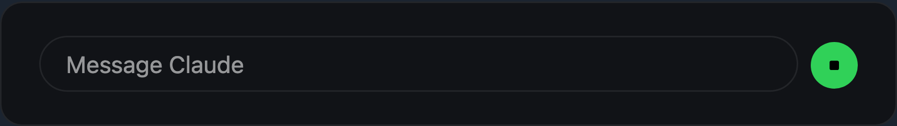

One button beside the field: an arrow while there is something to send, a white
square on green while a turn runs, and pressing it ends the turn. The separate
`Stop` is gone. Interrupting always worked — what did not was saying so: no
`Stop` hook arrives for an interrupted turn, so the card sat `Working` until the
sweep. The press now puts the card to rest itself.
