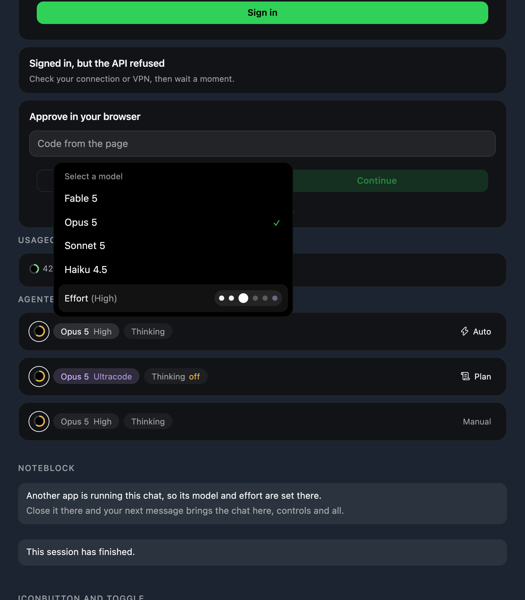
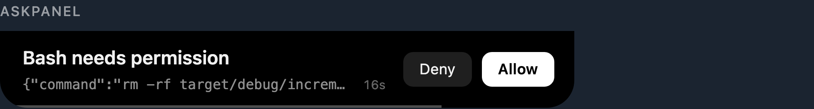
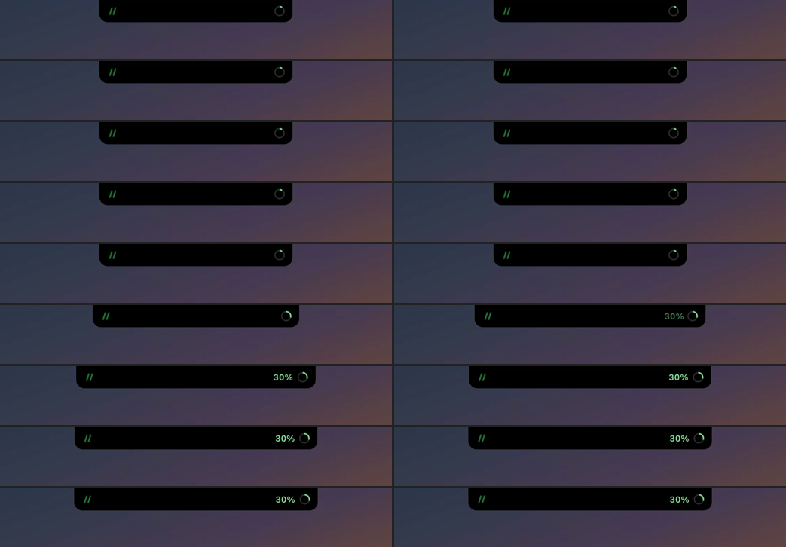
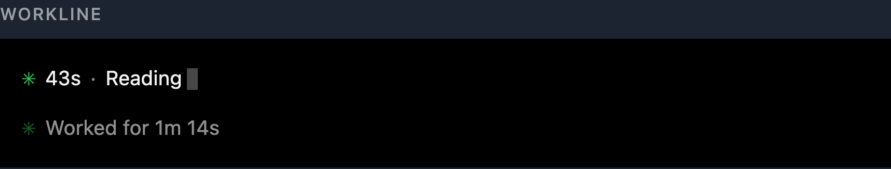

# Features

One entry per shipped feature, newest first: what it does, why, and where to
look at it. The contract for each lives in `tech.md` under the section named in
its row; this log exists so the repository itself remembers what was built and
carries the shots and clips that show it.

Add an entry when a feature merges. Keep it to what a person needs to recognise
the thing on screen — the reasoning belongs in `tech.md`, the mechanics belong
in the code.

| Version | Feature                                                                       | Contract            |
| ------- | ----------------------------------------------------------------------------- | ------------------- |
| v65     | [Composer row, as the original](#v65--composer-row-as-the-original)           | 6.12, 6.15, 6.20, 9 |
| v64     | [Live mode switching](#v64--live-mode-switching)                              | 6.19, 9             |
| v63     | [Permission mode](#v63--permission-mode)                                      | 6.3, 6.5, 6.19, 9   |
| v62     | [Usage request, as the CLI sends it](#v62--usage-request-as-the-cli-sends-it) | 6.4                 |
| v61     | [Sign in says what it decided](#v61--sign-in-says-what-it-decided)            | 6.3, 6.12, 6.16, 9  |
| v60     | [Composer layout](#v60--composer-layout)                                      | 6.12, 6.15, 9       |
| v59     | [Permission panel](#v59--permission-panel)                                    | 6.3, 6.7, 9         |
| v58     | [Usage badge](#v58--usage-badge)                                              | 6.8, 6.10, 6.18, 9  |
| v57     | [Work line](#v57--work-line)                                                  | 6.12, 9             |
| v56     | [Stop in the field button](#v56--stop-in-the-field-button)                    | 6.5, 6.15, 9        |

## v65 — Composer row, as the original

2026-09-09 · `61f88e7`

Left to right: the context ring, the model with its weight, thinking, then a
gap, then the mode beside the send button. The ring is furthest from send
because it acts on what is already spent; the mode is nearest because it
decides what the next press may do.

One menu holds model and effort, the effort as a track carrying the CLI's own
five descriptions, with `ultracode` as the stop past the last level — its own
command, because `--effort` does not take it, and its own colour, `#d0b4ff`.

Thinking is a grey block with a switch. `MAX_THINKING_TOKENS=0` is the only
lever the CLI offers and the process reads it once at startup, so it is set
before a session runs and read after.

## v64 — Live mode switching

2026-09-09 · `1025df4`

The cycle `Shift+Tab` walks was measured on a live TUI rather than assumed:
manual → accept edits → plan → auto → manual. Four states, and neither
`bypassPermissions` nor `dontAsk` is on it — no number of presses reaches
them, which is what makes stepping it on someone's behalf safe. So a running
session switches from the chip: one CSI Z per step, 250ms apart, confirmed by
the next hook.

Chevrons are gone. A sign carries what they carried — hand, `</>`, scroll,
bolt — and a value that only reads is dimmed instead. The menu takes a minimum
width, because one sized by its longest word wrapped every hint.

## v63 — Permission mode

2026-09-09 · `451c2e0`

The mode sits in the composer closest to the send button, because it decides
what pressing send will be allowed to do: `Manual`, `Edit automatically`,
`Plan`, `Auto`, each with a line under it in the menu.

Read from `permission_mode`, which every hook of a live session carries. Set
with `--permission-mode` on a session Peekle starts — the CLI has no slash
command for the mode, and its inbox does not speak the control protocol that
does. A session already under way reads instead of picking: cycling Shift+Tab
blind through a list that contains `bypassPermissions` is not something to do
on someone's behalf.

## v62 — Usage request, as the CLI sends it

2026-09-09 · `23dcc7e`

Claude Code sends two headers on its claude.ai OAuth calls —
`Authorization: Bearer` and `anthropic-beta: oauth-2025-04-20` — and
`/api/oauth/usage` is one of them. Peekle sent the first only, so a good token
came back refused and the island called it `Signed out`.

Two more things copied from the same binary: the CLI checks `expiresAt`
against the clock rather than waiting for a 401 (120s soft, 30s hard), and on
a 401 it refreshes and retries once. Peekle cannot refresh — the entry belongs
to Claude Code — so it declines to spend a request on a spent credential, and
its retry is a second read of the entry.

## v61 — Sign in says what it decided

2026-09-09 · `933b7e8`

Pressing `Sign in` under the session list changed nothing on screen. The press
worked: the command asks the CLI first, `claude auth status --json` said the
account was signed in, and it published the verdict that a login would not
help. The strip had nowhere to put it — a title and a button, no line and no
error — so the press moved zero pixels.

The strip is the panel in one column now: title, line, error, the code field
when the CLI asks for one, and the way out. A new stage, `Refused`, separates
"signed in and the endpoint refused anyway" from "the login would not start":
the first offers no button, the second keeps one.

The action button spans its block in both forms, and the hairline above the
field is gone — the capsule draws its own edge.

## v60 — Composer layout

2026-09-09 · `de43a62`

The field, its settings and the send button are one capsule: the text on top,
the model and the effort under it on the left, the send circle on the right —
the layout Claude Code's own composer uses, for the reason it uses it. Those two
are controls of the message being written, not a line about the session, and as
a separate strip above the field they read as a band between the feed and the
input.

The context ring left that strip for the top right corner, beside `5h` and `7d`.
Three rings answer one question — how much is left — so they stand together. It
is still the button that compacts, and still the only one.

Picker menus grow from the button that opened them rather than appearing whole.

## v59 — Permission panel

2026-09-09 · `ea284d8`

A permission opens the island a little instead of opening the whole dialogue:
the tool name, the input it was handed, `Deny` dark and `Allow` white. A
hairline under the text leaks through the twenty seconds the panel stands.
Pressing anywhere but the buttons lands in the session, for reading what is
being agreed to. The twenty seconds belong to the panel, never to the hook: the
request stays pending when they run out, and the mark goes on pulsing.

Nothing moves when the island already stands on that session — the person is
reading the thing the request is about.

## v58 — Usage badge

2026-09-08 · `428527f`

[`usage-badge.mp4`](usage-badge.mp4) — twelve seconds, two crossings.

Every time the five hour window crosses a ten, the resting island springs wider
and the percent steps out to the left of the ring, stands three and a half
seconds and goes back. Upward only, and never on the first reading. The shape
leads and the number follows it in; on the way out the number leaves first.

Switch under the gear, `[usage] badge` in the config, on by default. Flicking it
on holds a preview until the island rests.

## v57 — Work line

2026-09-08 · `0688104`

The feed prints no tool calls. A run of them folds into one line with a clock:
the mark, the elapsed time and a word while the agent is out, `Worked for 42s`
once it is back. The run is dated from the record before it, because that is
where the person started counting.

## v56 — Stop in the field button

2026-09-08 · `4e41965`

One button beside the field: an arrow while there is something to send, a white
square on green while a turn runs, and pressing it ends the turn. The separate
`Stop` is gone. Interrupting always worked — what did not was saying so: no
`Stop` hook arrives for an interrupted turn, so the card sat `Working` until the
sweep. The press now puts the card to rest itself.
